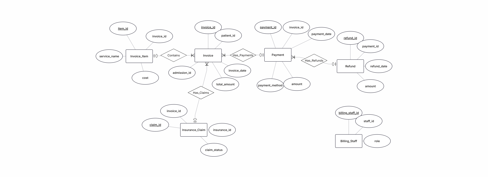
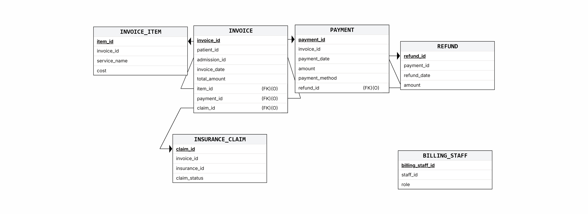
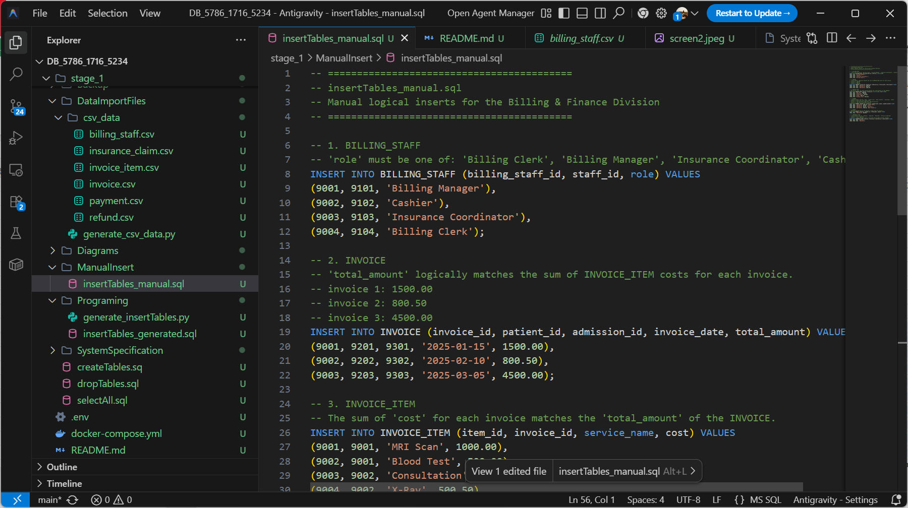
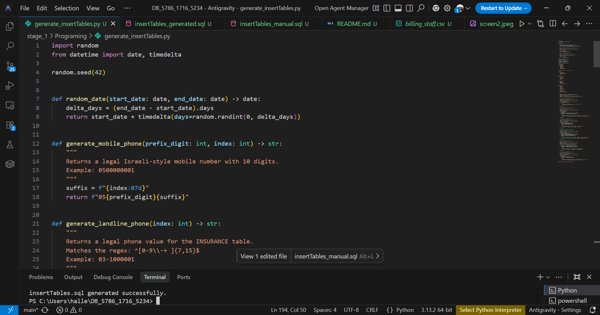

# DB_5786_1716_5234
# Hospital Management System – Billing & Finance Division

## Submitted by:
Hallel Ochana
Chen Afuta

## System:
Hospital Management System

## Selected Unit:
Billing & Finance Division

## Table of Contents
1. Introduction
2. System Screens (AI Generated)
3. ERD Diagram
4. DSD Diagram
5. Design Decisions
6. Data Insertion Methods
7. Backup and Restore

## Introduction
The system is designed to manage hospital billing and financial operations.

It stores data related to invoices, payments, refunds, insurance claims, and billing staff.

The main functionalities include:
- Creating and managing invoices
- Tracking invoice items and services
- Recording payments and refunds
- Managing insurance claims
- Assigning billing staff roles

## System Screens (AI Generated)

### Invoice Management

### Invoice Details

### Payments and Refunds

### Insurance Claims and Billing Staff

## ERD Diagram

## DSD Diagram

## Design Decisions

- The Invoice table is separated from Invoice_Item to support multiple services per invoice.
- Payments and Refunds are separated to allow tracking financial transactions accurately.
- Insurance claims are linked to invoices to manage coverage.
- Billing staff roles are stored separately for flexibility and normalization.

## Data Insertion Methods

Three methods were used to insert data:

1. Manual SQL INSERT statements

2.Programming

3. Data Import Files

## Backup and Restore

