# DB_5786_1716_5234
# Hospital Management System – Billing & Finance Division

## Submitted by:
Hallel Ochana
Chen Afuta

## System:
Hospital Management System

## Selected Unit:
Billing & Finance Division

## Table of Contents
1. Introduction
2. System Screens (AI Generated)
3. ERD Diagram
4. DSD Diagram
5. Design Decisions
6. Data Insertion Methods
7. Backup and Restore

## Introduction
The system is designed to manage hospital billing and financial operations.

It stores data related to invoices, payments, refunds, insurance claims, and billing staff.

The main functionalities include:
- Creating and managing invoices
- Tracking invoice items and services
- Recording payments and refunds
- Managing insurance claims
- Assigning billing staff roles

## System Screens (AI Generated)
https://ai.studio/apps/ff1c6d46-d62f-40b6-a2b2-a5877b81b10b
### Invoice Management


### Invoice Details


### Payments and Refunds


### Insurance Claims and Billing Staff


## ERD Diagram


## DSD Diagram


## Design Decisions

- The Invoice table is separated from Invoice_Item to support multiple services per invoice.
- Payments and Refunds are separated to allow tracking financial transactions accurately.
- Insurance claims are linked to invoices to manage coverage.
- Billing staff roles are stored separately for flexibility and normalization.

## Data Insertion Methods

Three methods were used to insert data:

1. Manual SQL INSERT statements


2.Programming


3. Data Import Files


## Backup and Restore


# שלב ב – תשאול בסיס הנתונים (SQL Queries)

---

## מבוא

בשלב זה ביצענו תשאול של בסיס הנתונים באמצעות שאילתות `SQL`.  
השתמשנו בשאילתות מסוג `SELECT`, `UPDATE`, `DELETE`, וכן הדגמנו שימוש ב־`Transactions` (`ROLLBACK`, `COMMIT`), הוספנו אילוצים (`Constraints`) ואינדקסים (`Indexes`), ובדקנו את השפעתם על ביצועי המערכת.

---

# 1. שאילתות SELECT עם השוואה

## שאילתה 1 – תשלומים עם פרטי חשבונית

### תיאור
השאילתה מציגה תשלומים יחד עם פרטי החשבונית שלהם.

### שאילתה 1A (`JOIN`)

```sql
SELECT 
    p.payment_id,
    p.payment_date,
    p.amount,
    p.payment_method,
    i.invoice_id,
    i.invoice_date,
    i.total_amount
FROM payment p
JOIN invoice i ON p.invoice_id = i.invoice_id;
```

### שאילתה 1B (`Subquery`)

```sql
SELECT
    p.payment_id,
    p.payment_date,
    p.amount,
    p.payment_method,
    p.invoice_id,
    (SELECT i.invoice_date FROM invoice i WHERE i.invoice_id = p.invoice_id),
    (SELECT i.total_amount FROM invoice i WHERE i.invoice_id = p.invoice_id)
FROM payment p;
```

### הרצה ותוצאה

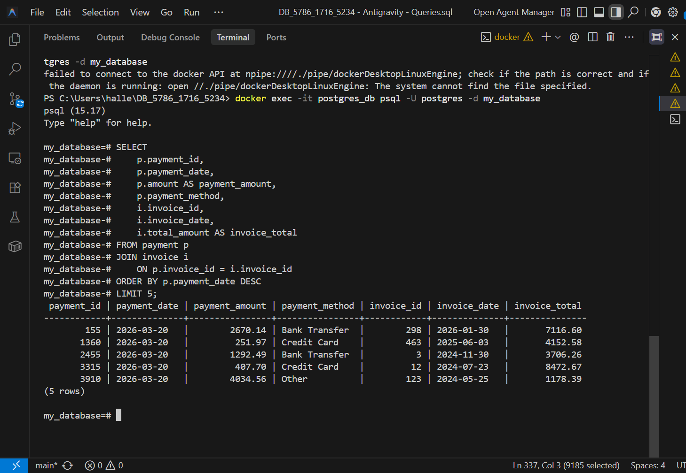

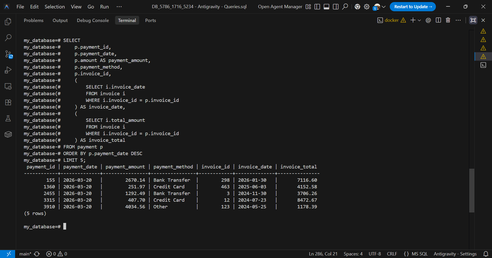

### הסבר הבדל
השימוש ב־`JOIN` מאפשר חיבור ישיר ויעיל יותר בין הטבלאות.  
לעומת זאת, `Subquery` מבוצעת עבור כל שורה ולכן פחות יעילה.

---

## שאילתה 2 – החזרים עם פרטי תשלום מקורי

### תיאור
השאילתה מציגה החזרים כספיים יחד עם פרטי התשלום המקורי שבוצע במערכת.

### שאילתה 2A (`JOIN`)

```sql
SELECT
    r.refund_id,
    r.refund_date,
    r.amount AS refund_amount,
    r.refund_reason,
    p.payment_id,
    p.payment_date,
    p.amount AS original_payment_amount,
    p.payment_method
FROM refund r
JOIN payment p
    ON r.payment_id = p.payment_id
ORDER BY r.refund_date DESC
LIMIT 5;
```

### שאילתה 2B (`Subquery`)

```sql
SELECT
    r.refund_id,
    r.refund_date,
    r.amount AS refund_amount,
    r.refund_reason,
    r.payment_id,
    (
        SELECT p.payment_date
        FROM payment p
        WHERE p.payment_id = r.payment_id
    ) AS payment_date,
    (
        SELECT p.amount
        FROM payment p
        WHERE p.payment_id = r.payment_id
    ) AS original_payment_amount,
    (
        SELECT p.payment_method
        FROM payment p
        WHERE p.payment_id = r.payment_id
    ) AS payment_method
FROM refund r
ORDER BY r.refund_date DESC
LIMIT 5;
```

### הרצה ותוצאה

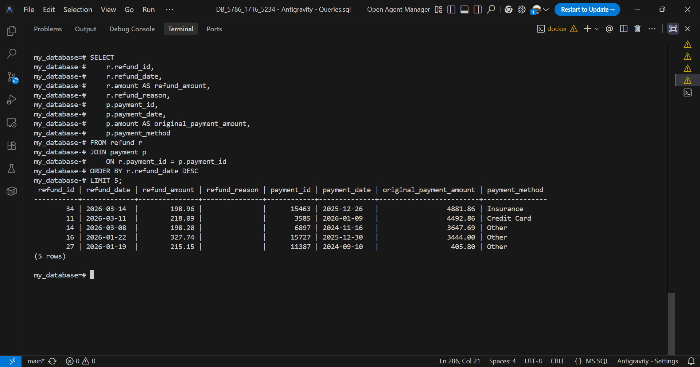

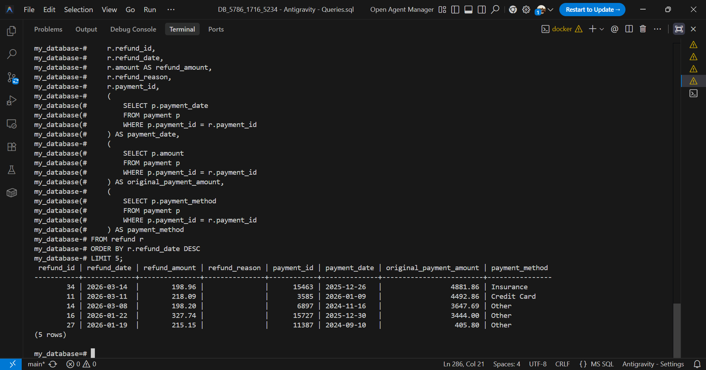

### הסבר הבדל
השימוש ב־`JOIN` יעיל יותר כי החיבור בין הטבלאות מתבצע באופן ישיר.  
ב־`Subquery`, מתבצע חיפוש נוסף עבור כל שורה ולכן הביצועים פחות טובים.

---

## שאילתה 3 – הכנסות חודשיות

### שאילתה 3A (`EXTRACT`)

```sql
SELECT
    EXTRACT(YEAR FROM payment_date) AS year,
    EXTRACT(MONTH FROM payment_date) AS month,
    SUM(amount)
FROM payment
GROUP BY year, month;
```

### שאילתה 3B (`DATE_TRUNC`)

```sql
SELECT
    DATE_TRUNC('month', payment_date) AS month,
    SUM(amount)
FROM payment
GROUP BY DATE_TRUNC('month', payment_date);
```

### הרצה ותוצאה

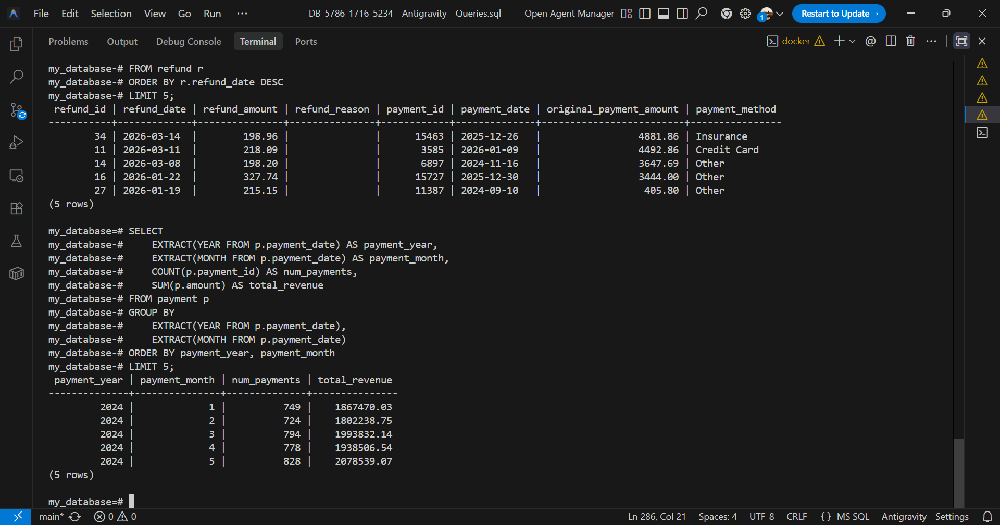

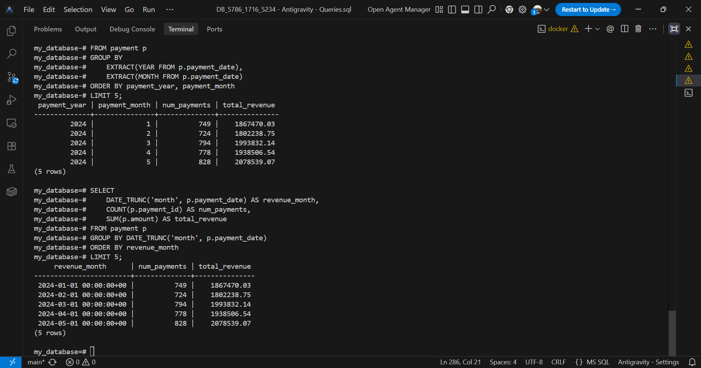

### הסבר הבדל
`EXTRACT` מפרק את התאריך לשנה וחודש בנפרד.  
`DATE_TRUNC` מקבץ את הנתונים לפי חודש מלא ולכן מתאים יותר לדוחות וגרפים.

---

## שאילתה 4 – פילוח שיטות תשלום

### שאילתה 4A

```sql
SELECT payment_method, COUNT(*)
FROM payment
GROUP BY payment_method;
```

### שאילתה 4B

```sql
SELECT *
FROM (
    SELECT payment_method, COUNT(*) AS total_payments
    FROM payment
    GROUP BY payment_method
) AS payment_summary;
```

### הרצה ותוצאה


### הסבר הבדל
שתי השאילתות מחזירות את אותה תוצאה.  
הצורה הראשונה פשוטה וישירה יותר, והצורה השנייה משתמשת בטבלה נגזרת.

---

# 2. שאילתות SELECT נוספות

## שאילתה 5 – החזרים חודשיים

```sql
SELECT
    EXTRACT(MONTH FROM refund_date),
    SUM(amount)
FROM refund
GROUP BY EXTRACT(MONTH FROM refund_date);
```

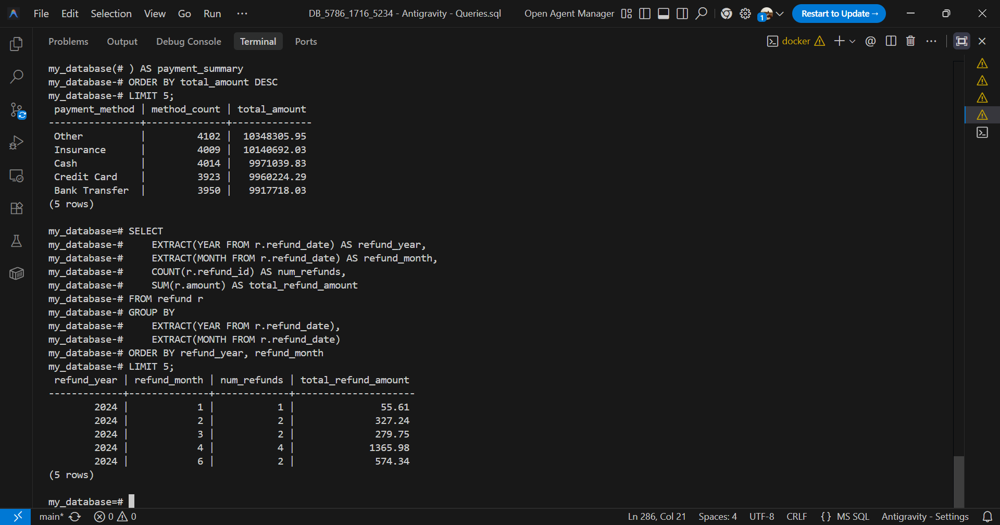

---

## שאילתה 6 – חשבוניות מעל הממוצע

```sql
SELECT *
FROM invoice
WHERE total_amount > (SELECT AVG(total_amount) FROM invoice);
```

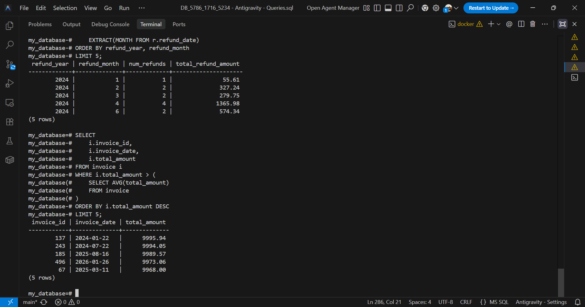

---

## שאילתה 7 – פריטי חשבוניות

```sql
SELECT *
FROM invoice_item;
```

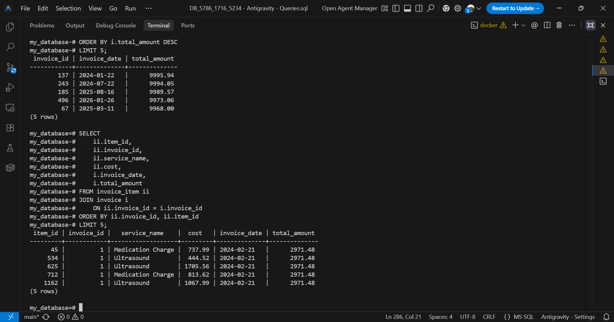

---

## שאילתה 8 – צוות גבייה

```sql
SELECT *
FROM billing_staff;
```

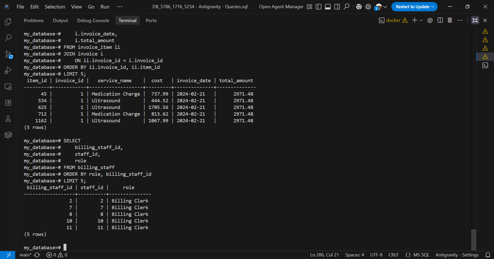

---

# 3. שאילתות UPDATE

## עדכון 1 – עדכון שיטת תשלום

```sql
UPDATE payment
SET payment_method = 'Cash'
WHERE payment_id = 1;
```

### לפני ואחרי

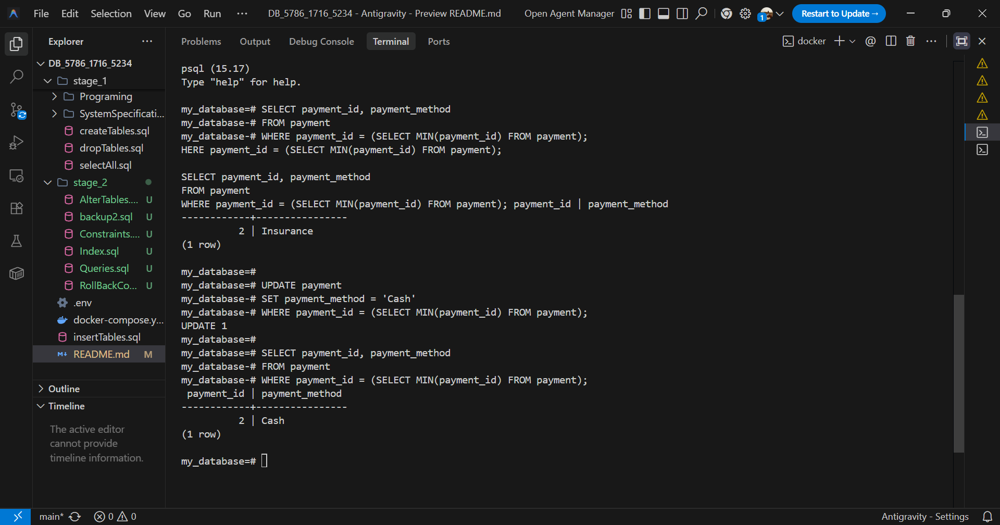


---

## עדכון 2 – עדכון תפקיד עובד

```sql
UPDATE billing_staff
SET role = 'Cashier'
WHERE billing_staff_id = 1;
```

### לפני ואחרי

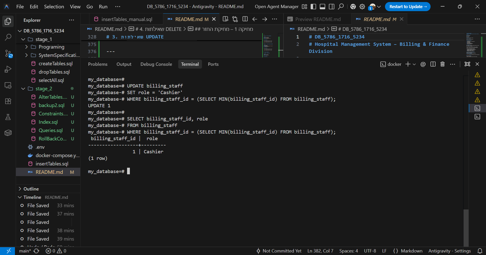


---

## עדכון 3 – עדכון שיטת תשלום נוספת

```sql
UPDATE payment
SET payment_method = 'Bank Transfer'
WHERE payment_id = 2;
```

### לפני ואחרי

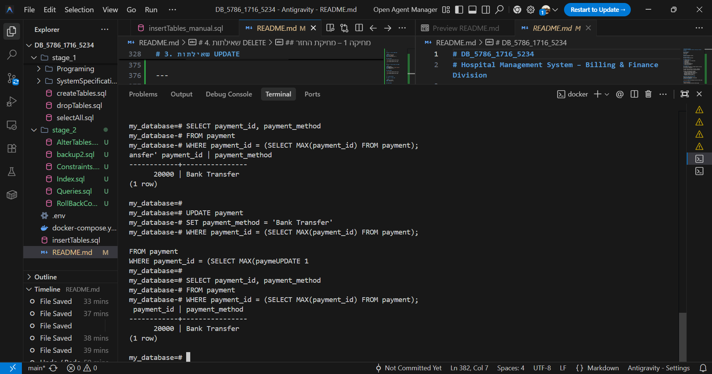


---

# 4. שאילתות DELETE

## מחיקה 1 – מחיקת החזר

```sql
DELETE FROM refund
WHERE refund_id = 1;
```

### לפני ואחרי

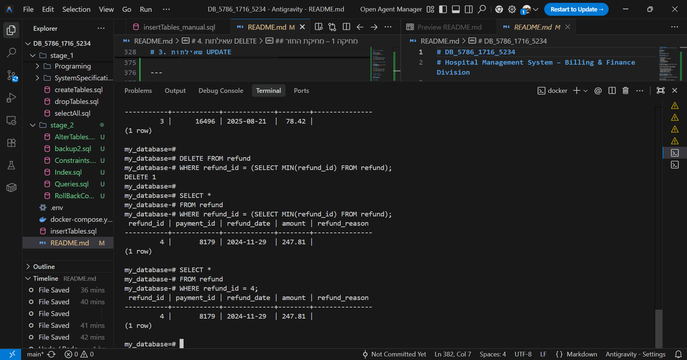


---

## מחיקה 2 – מחיקת תשלום

```sql
DELETE FROM payment
WHERE payment_id = 2;
```

### לפני ואחרי

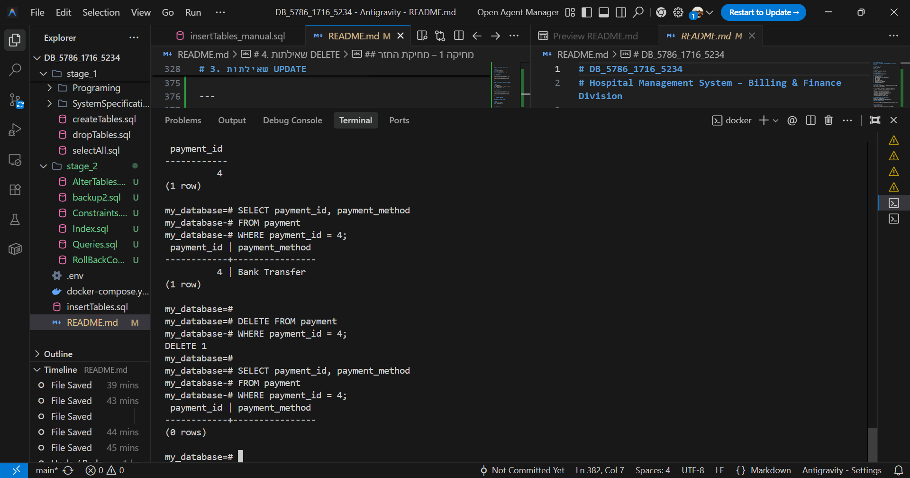


---

## מחיקה 3 – מחיקת עובד מצוות הגבייה

```sql
DELETE FROM billing_staff
WHERE billing_staff_id = 3;
```

### לפני ואחרי

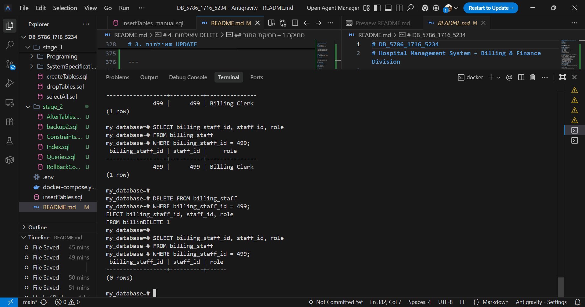


---

# 5. Transactions

## ROLLBACK

### הסבר
פקודת `ROLLBACK` מבטלת את השינויים שבוצעו ומחזירה את בסיס הנתונים למצבו הקודם.

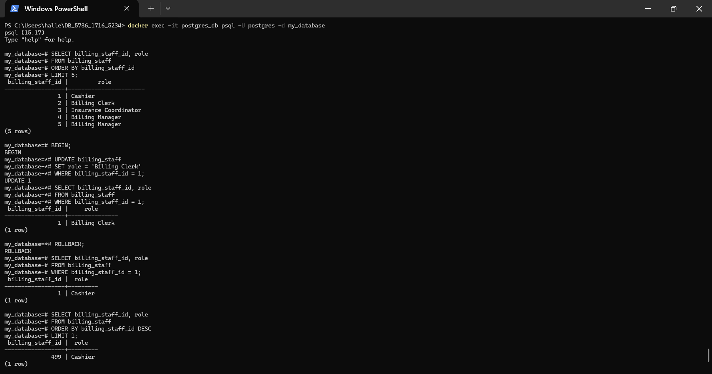

---

## COMMIT

### הסבר
פקודת `COMMIT` שומרת את השינויים לצמיתות במסד הנתונים.

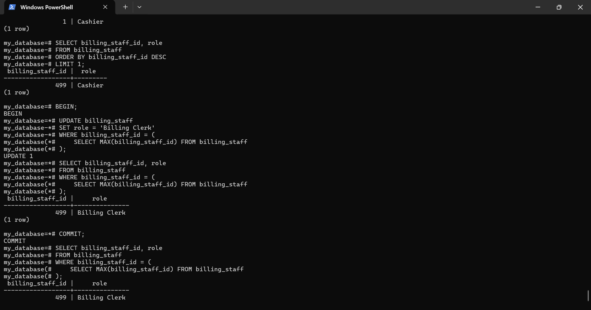

---

# 6. אילוצים (`Constraints`)

## אילוץ 1 – סיבת החזר לא ריקה

```sql
ALTER TABLE refund
ADD CONSTRAINT chk_refund_reason_not_empty
CHECK (TRIM(refund_reason) <> '');
```

### בדיקת שגיאה

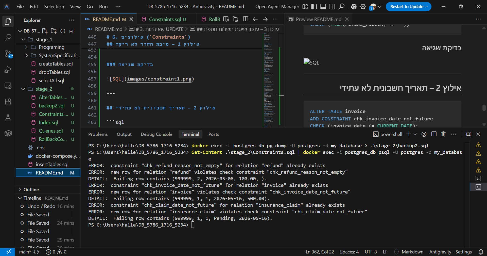

---

## אילוץ 2 – תאריך חשבונית לא עתידי

```sql
ALTER TABLE invoice
ADD CONSTRAINT chk_invoice_date_not_future
CHECK (invoice_date <= CURRENT_DATE);
```

### בדיקת האילוץ
INSERT INTO refund (refund_id, payment_id, refund_date, amount, refund_reason)
VALUES (999999, 2, CURRENT_DATE, 100.00, '');

### תוצאה


---

## אילוץ 3 – תאריך תביעה לא עתידי

```sql
ALTER TABLE insurance_claim
ADD CONSTRAINT chk_claim_date_not_future
CHECK (claim_date <= CURRENT_DATE);
```

### בדיקת שגיאה


---

# 7. אינדקסים (`Indexes`)

## אינדקס 1 – `payment_date`

```sql
CREATE INDEX idx_payment_payment_date
ON payment(payment_date);
```

### לפני ואחרי

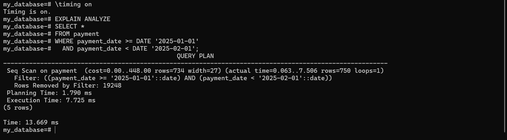

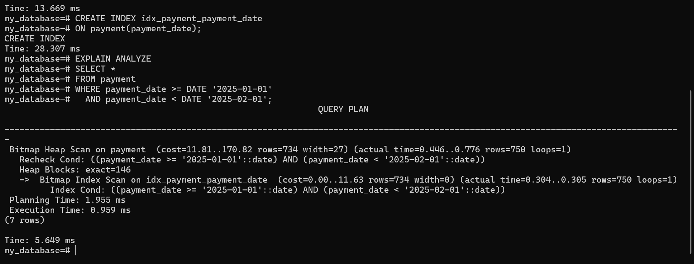

---

## אינדקס 2 – `invoice_id`

```sql
CREATE INDEX idx_payment_invoice_id
ON payment(invoice_id);
```

### לפני ואחרי

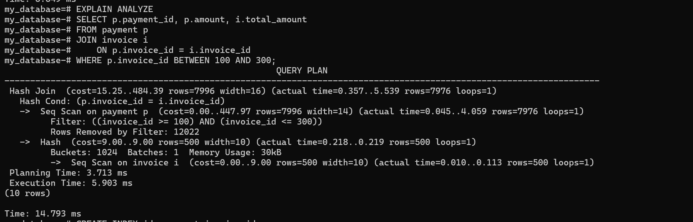

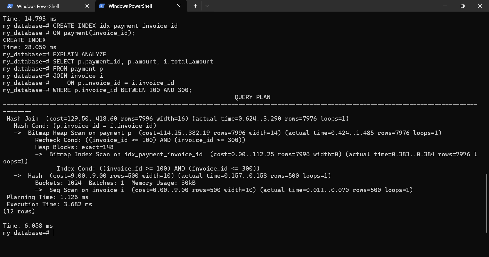

---

## אינדקס 3 – `payment_id`

```sql
CREATE INDEX idx_refund_payment_id
ON refund(payment_id);
```

### לפני ואחרי

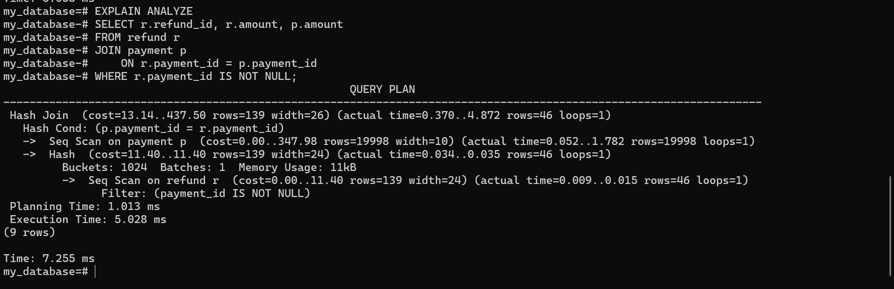

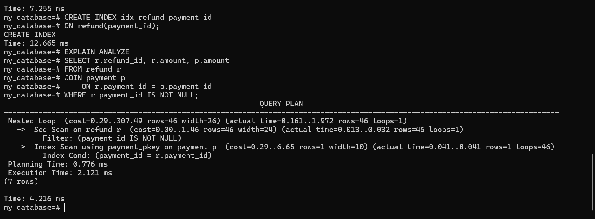

---

# 8. הסבר על אילוצים ואינדקסים

## אילוצים
האילוצים נועדו לשמור על תקינות הנתונים ולמנוע הכנסת נתונים שגויים למסד הנתונים.

## אינדקסים
האינדקסים נועדו לשפר את זמני הריצה של שאילתות, בעיקר כאשר משתמשים ב־`WHERE`, `JOIN`, או מיון לפי שדות נפוצים.


דוח הפרויקט – שלב ג׳
אינטגרציה ומבטים
הקדמה

בשלב זה ביצענו אינטגרציה בין מערכת Billing & Finance המקורית שלנו לבין מערכת נוספת לניהול עובדים ומשמרות בשם Staff Management.

מטרת האינטגרציה הייתה ליצור בסיס נתונים משולב המאפשר חיבור בין מידע פיננסי לבין מידע ארגוני ותפעולי של עובדים, מחלקות, משמרות ושכר.

האינטגרציה בוצעה לפי שיטה א׳ — אינטגרציה ברמת התכנון והסכמה הלוגית, תוך שימוש בטבלאות הקיימות ושינוי בסיס הנתונים באמצעות פקודות ALTER TABLE ויצירת קשרים חדשים.

1. DSD של האגף החדש

בשלב הראשון קיבלנו גיבוי של מערכת Staff Management.

לאחר שחזור בסיס הנתונים ניתחנו את הטבלאות, המפתחות והקשרים, ומתוכם יצרנו DSD המתאר את הסכמה הלוגית של המערכת.

המערכת כללה את הטבלאות:

Staff
Departments
Roles
Shifts
ShiftAssignments
Salaries
Screenshot – New Department DSD

2. ERD של האגף החדש

לאחר יצירת ה־DSD ביצענו תהליך Reverse Engineering שבמסגרתו עברנו מהסכמה הלוגית בחזרה לתרשים ERD.

בשלב זה זיהינו:

ישויות מרכזיות
מאפיינים
מפתחות ראשיים
קשרים בין הישויות
Cardinality של כל קשר
Screenshot – New Department ERD

3. אלגוריתם Reverse Engineering

תהליך ההינדוס לאחור בוצע לפי השלבים הבאים:

זיהוי כל הטבלאות בבסיס הנתונים.
זיהוי המפתחות הראשיים של כל טבלה.
זיהוי המפתחות הזרים והקשרים בין הטבלאות.
כל טבלה עצמאית הוגדרה כישות ב־ERD.
כל עמודה שאינה מפתח זר הוגדרה כמאפיין של הישות.
מפתחות זרים הומרו לקשרים בין הישויות.
טבלאות המכילות מאפיינים עצמאיים בנוסף למפתחות זרים הוגדרו כישויות מקשרות.
לאחר ניתוח הקשרים נבנה ERD חדש המתאר את המערכת שהתקבלה.
4. החלטות אינטגרציה

בשלב האינטגרציה השווינו בין שתי המערכות:

Billing & Finance
Staff Management

זיהינו חפיפה בין הישויות:

Billing_Staff
Staff

שתי הישויות מייצגות עובדים במערכת, ולכן החלטנו לאחד אותן לישות אחת בשם:

Staff

בנוסף:

הוספנו קשר בין Staff לבין Invoice כדי לאפשר מעקב אחר העובד שטיפל בחשבונית.
הישויות Departments, Roles, Shifts, ShiftAssignments ו־Salaries נשמרו מהמערכת החדשה.
הישויות Invoice, Invoice_Item, Payment, Refund ו־Insurance_Claim נשמרו מהמערכת המקורית.
מערכת השכר והמשמרות שולבה עם מערכת החיובים והפיננסים.

באופן זה נוצר בסיס נתונים משולב המאפשר ניהול עובדים, מחלקות, משמרות, שכר, חשבוניות ותשלומים במערכת אחת.

5. ERD משותף

לאחר קבלת החלטות האינטגרציה יצרנו ERD משולב המכיל את הישויות והקשרים משתי המערכות.

Screenshot – Integrated ERD

6. DSD לאחר אינטגרציה

מתוך ה־ERD המשולב יצרנו DSD חדש המתאר את הסכמה הלוגית הסופית של בסיס הנתונים לאחר האינטגרציה.

Screenshot – Integrated DSD

7. הסבר על Integrate.sql

קובץ Integrate.sql כולל את כל פקודות השינוי שנדרשו לצורך האינטגרציה.

הפעולות שבוצעו:

הוספת עמודות חדשות
יצירת קשרים חדשים
הוספת Foreign Keys
יצירת טבלאות חדשות במידת הצורך
הוספת Constraints

האינטגרציה בוצעה באמצעות:

ALTER TABLE
ADD COLUMN
ADD CONSTRAINT
CREATE TABLE

ולא באמצעות יצירה מחדש של כל בסיס הנתונים.

8. מבטים (Views)
View 1 – Customer Invoice Payments

מבט זה מציג מידע על חשבוניות ותשלומים שבוצעו עבורן.

יצירת המבט
CREATE OR REPLACE VIEW customer_invoice_payments AS
SELECT
    i.invoice_id,
    i.invoice_date,
    i.total_amount,
    p.payment_id,
    p.payment_date,
    p.amount,
    p.payment_method
FROM invoice i
JOIN payment p
ON i.invoice_id = p.invoice_id;
שליפת נתונים מהמבט
SELECT *
FROM customer_invoice_payments
LIMIT 10;
Screenshot

View 2 – Staff Shift Schedule

מבט זה מציג עובדים והמשמרות שלהם.

יצירת המבט
CREATE OR REPLACE VIEW staff_shift_schedule AS
SELECT
    s.staffid,
    s.firstname,
    s.lastname,
    sh.shifttype,
    sa.workdate,
    sa.starttime,
    sa.endtime
FROM staff s
JOIN shiftassignments sa
ON s.staffid = sa.staffid
JOIN shifts sh
ON sa.shiftid = sh.shiftid;
שליפת נתונים מהמבט
SELECT *
FROM staff_shift_schedule
LIMIT 10;
Screenshot

View 3 – Staff Salary Summary

מבט זה מציג מידע על משכורות עובדים.

יצירת המבט
CREATE OR REPLACE VIEW staff_salary_summary AS
SELECT
    s.staffid,
    s.firstname,
    s.lastname,
    sal.month,
    sal.year,
    sal.baseamount,
    sal.bonusamount,
    sal.overtimehours
FROM staff s
JOIN salaries sal
ON s.staffid = sal.staffid;
שליפת נתונים מהמבט
SELECT *
FROM staff_salary_summary
LIMIT 10;
Screenshot

9. שאילתות על המבטים
Query 1 – Total Payments Per Invoice

שאילתה זו מציגה את סכום התשלומים לכל חשבונית.

SELECT
    invoice_id,
    SUM(amount) AS total_paid
FROM customer_invoice_payments
GROUP BY invoice_id
ORDER BY total_paid DESC;
Screenshot

Query 2 – Payments By Payment Method

שאילתה זו מציגה את מספר התשלומים לפי שיטת תשלום.

SELECT
    payment_method,
    COUNT(*) AS payment_count
FROM customer_invoice_payments
GROUP BY payment_method;
Screenshot

Query 3 – Employees Working Night Shifts

שאילתה זו מציגה עובדים שעבדו במשמרות לילה.

SELECT *
FROM staff_shift_schedule
WHERE shifttype = 'Night';
Screenshot

Query 4 – Number of Shifts Per Employee

שאילתה זו מציגה כמה משמרות יש לכל עובד.

SELECT
    firstname,
    lastname,
    COUNT(*) AS shifts_count
FROM staff_shift_schedule
GROUP BY firstname, lastname
ORDER BY shifts_count DESC;
Screenshot

Query 5 – Employees With Highest Bonuses

שאילתה זו מציגה עובדים שקיבלו את הבונוסים הגבוהים ביותר.

SELECT
    firstname,
    lastname,
    MAX(bonusamount) AS max_bonus
FROM staff_salary_summary
GROUP BY firstname, lastname
ORDER BY max_bonus DESC;
Screenshot

Query 6 – Overtime Hours Per Employee

שאילתה זו מציגה את סך שעות הנוספות לכל עובד.

SELECT
    firstname,
    lastname,
    SUM(overtimehours) AS total_overtime
FROM staff_salary_summary
GROUP BY firstname, lastname
ORDER BY total_overtime DESC;
Screenshot

10. סיכום

בשלב זה הצלחנו לבצע אינטגרציה מלאה בין שתי מערכות שונות:

מערכת פיננסית
מערכת ניהול עובדים ומשמרות

באמצעות תהליך Reverse Engineering, תכנון ERD משותף, יצירת DSD חדש ושינוי בסיס הנתונים הקיים, יצרנו מערכת משולבת המאפשרת ניהול עובדים, מחלקות, משמרות, משכורות, חשבוניות ותשלומים במבנה אחיד ומקושר.